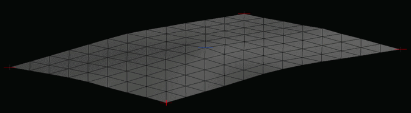

# WebGPU Cloth Simulation

A real-time cloth simulation implemented from scratch using WebGPU and JavaScript.

## About

This project explores real-time cloth simulation using modern WebGPU rendering.

The simulation is based on Verlet integration and distance constraints without using external physics engines. The goal was to implement the core algorithms manually and gain a deeper understanding of GPU rendering pipelines, cloth physics, and modern browser graphics APIs.

## Demo

The animation below demonstrates the cloth simulation. Gravity can be enabled during runtime, causing the cloth to deform while the driven center vertex continues its sinusoidal motion.



## Features

- Cloth simulation based on Verlet integration
- Distance constraint solver
- Triangle mesh generation
- Lambert lighting
- Toggleable gravity
- Pinned vertices
- Driven control vertex
- Debug visualization with wireframe and vertex markers

## Algorithms

- Verlet integration for particle movement
- Position-based distance constraints for cloth behavior
- Triangle mesh generation
- Vertex normal calculation for lighting

## Technologies

- JavaScript (ES6)
- WebGPU API
- WGSL shaders
- Vite

## Project Structure

```text
src/
├── renderer/      # WebGPU rendering pipeline
│   └── WebGPU.js
├── shaders/       # WGSL shaders
│   ├── cloth.wgsl
│   └── debug.wgsl
├── simulation/    # Cloth simulation logic
│   └── ClothSimulation.js
└── main.js        # Application entry point
```

## Running locally

Install dependencies:

```bash
npm install
```

Start development server:

```bash
npm run dev
```

The application will be available at:

http://localhost:5173/

## Planned Improvements

- Perspective camera
- Mouse interaction
- Wind simulation
- Vertex picking
- Cloth tearing
- Compute shader implementation for physics simulation

## License

This project is provided for educational and portfolio purposes.